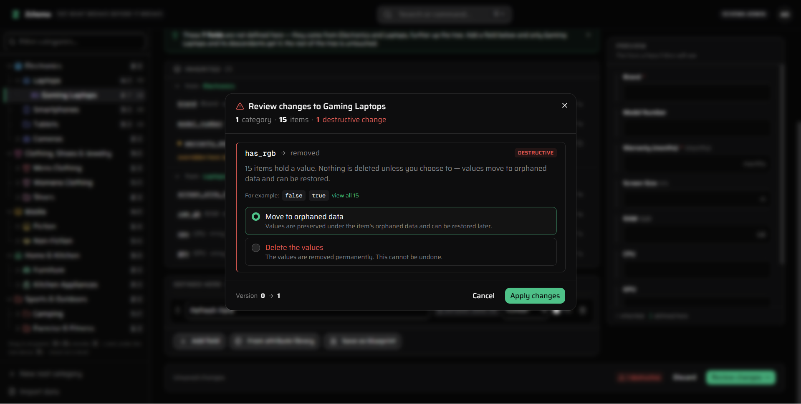
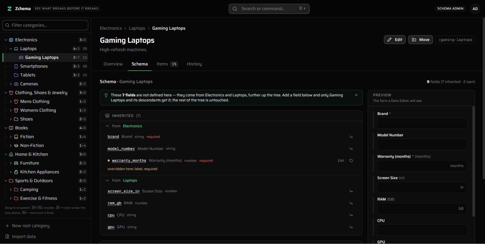

# Zchema

**Change your data model against live records — and see exactly what breaks before it breaks.**

Most catalog tools let you edit a schema and find out afterwards. Zchema shows you the
blast radius first: which categories, how many items, which values will not survive, and what
should happen to each one. Then it applies the change in a single transaction and keeps a
versioned record you can diff and roll back.

It is a schema-migration tool with a catalog attached, not a catalog with a schema editor.

---

## The problem

A product catalog is a tree, and the tree is the point. `Electronics` defines `brand` and
`warranty_months`. `Laptops` inherits both and adds `screen_size_in`, `gpu`. `Smartphones`
inherits the same two and adds `battery_mah` — and cannot see a single Laptops field.

Template-based tools get this wrong in a specific way: a category gets *one* template and no
ability to add anything of its own, so `Laptops` and `Smartphones` are forced to share a schema
neither of them wants. Adding `gpu` for laptops pollutes every phone.

Zchema puts the schema **on the category node** and composes it down the tree:

```
blueprints (optional presets)        attributes (shared field registry)
        │ copied-from                            │ referenced-by
        ▼                                        ▼
    categories ── own_fields, overrides, parent_id
        │
        │  effective_schema = fold(ancestors.own_fields) + own_fields,
        │                     with overrides applied
        ▼
      items ── data JSONB, schema_version
        │
        ▼
  schema_versions ── immutable, append-only snapshots
```

A child may **add** fields, and **override** an inherited field's label, requiredness, options,
default, help text or position. It may **not** delete an inherited field or change its type —
the two operations that would silently invalidate data its ancestors own.

---

## What makes it interesting

**Impact analysis before the change.** Make `warranty_months` required on `Electronics` and,
before saving, you see:

```
⚠  This change affects 4 categories and 48 items.

    ● warranty_months  →  now required                    WARNING
      31 of 48 items have no value for this field and will be flagged incomplete.
      → Backfill all with [ 12 ] · Leave blank and flag incomplete

    ● screen_size_in   →  number → string                 DESTRUCTIVE
      20 items hold a value, and all 20 convert cleanly to the new type.
      → Convert values · Move to orphaned data · Delete the values

    Version 4 → 5.                        [ Cancel ]  [ Apply changes ]
```

The severity badge updates **as you type**, so you feel the risk building rather than
discovering it at the end.

**No value is ever silently lost.** A field that disappears moves its values to
`data.__orphaned.<key>`, where they stay restorable. `discard` — the only strategy that
actually deletes — is never a default and needs a separate confirmation naming the count.

**Everything destructive routes through the same machinery.** Re-parenting a category and
deleting one both open the same impact dialog, because both do the same thing to item data.
There is exactly one place where "this will break things" is explained.

**Cross-category search that means something.** The attribute registry asserts that `brand` on
Electronics and `brand` on Clothing are the same concept rather than two strings that happen to
spell alike — which is what makes `brand:Sony` across the whole catalog answerable at all.

**Import that infers.** Paste a CSV and the field types, units and enum options are worked out
for you: `"16 GB"`, `"32 GB"` becomes `type: number, unit: "GB"`. Every inference states its
evidence (*"412/500 values parse as numbers"*), and genuinely ambiguous data — `03/04/2024` —
is asked about rather than guessed.

---

## Screenshots

**The impact dialog.** Removing `has_rgb` from `Gaming Laptops` before it is applied: 15 items
hold a value, and none of it is deleted unless you choose to — the default moves it to orphaned
data, where it can be restored.



**The Schema tab.** `Gaming Laptops` inherits seven fields from two ancestors and defines two of
its own. One inherited field, `warranty_months`, is overridden here; the preview on the right is
the form a Data Editor will see.



[`docs/DEMO.md`](docs/DEMO.md) walks to both in under two minutes.

---

## Setup

```bash
npm install
cp .env.example .env.local   # add your Supabase URL and anon key
npm run dev
```

The database ships as Supabase migrations. Against a new Supabase project (its reference ID is
under **Project Settings → General**):

```bash
npx supabase login
npx supabase link --project-ref <your-project-ref>
npm run db:push     # applies supabase/migrations/ in order and records each one
npm run db:status   # which migrations this database has run
```

The migrations are built from the feature files, which are the place to read the database. They
load in this order, each depending on the ones before it:

| file | what it adds |
|---|---|
| `supabase/schema.sql` | tables, `updated_at` triggers, roles, cycle guard |
| `supabase/functions.sql` | the resolver: `get_effective_schema`, `query_items`, `move_items` |
| `supabase/triggers.sql` | field-key uniqueness, override validation, slug generation |
| `supabase/policies.sql` | row-level security |
| `supabase/impact.sql` | `analyze_schema_change`, `apply_schema_change`, rollback |
| `supabase/attributes.sql` | the shared attribute registry |
| `supabase/search.sql` | full-text vector, `search_items`, facets |
| `supabase/import.sql` | transactional import |
| `supabase/onboarding.sql` | sample catalog, hint state |
| `supabase/trash.sql` | capture every delete, restore, purge |
| `supabase/invites.sql` | invitations, and claiming one |

Then paste one seed into the SQL editor:

| seed | shape |
|---|---|
| `seedAmazonFull.sql` | 32 categories, 265 items, 3 levels, several domains — the richest |
| `seedAmazon.sql` | 13 categories, 3 levels — the minimal inheritance demo |
| `seedVehicle.sql` | a structurally different second domain |
| `seedStress.sql` | 50 categories, 5,000 items — **truncates**, for timings only |

Roles: `SCHEMA_ADMIN` owns the data model, `DATA_EDITOR` owns item data only, `VIEWER` reads.
The first account to sign up on a fresh instance becomes `SCHEMA_ADMIN`; everyone after it starts
as `VIEWER`, and is either promoted from **Settings → Users** or invited with a role from
**Settings → Invitations**, which produces a signup link that carries the role.

Every feature file is safe to re-run, and none of them drops a table. The one script that does is
`supabase/dev/reset.sql`, for dev databases only. Every seed file **replaces** the catalog.

To change the database, edit the feature file and add a migration carrying the same change —
[`AGENTS.md`](AGENTS.md) has the rules.

### Tests

```bash
npm test            # 318 tests: resolver cases, migration drift, query DSL, CSV, export, redirects
npm run typecheck
npm run lint
```

CI runs all three on every pull request. SQL suites live in `supabase/tests/` and run in the
Supabase SQL editor; each ends in a result-set `SELECT` of PASS/FAIL rows.
`resolver_differential_test.sql` is generated from the same resolver cases `npm test` uses —
`npm run gen:resolver-sql` rewrites it after the fixture changes.

---

## Architecture decisions, and why

**Schema composition lives in SQL, mirrored in TypeScript, and one test holds all three copies
together.** `get_effective_schema()` is the authority. `resolve_schema_preview()` resolves a
*proposed* change for the impact dialog, and `resolveEffectiveSchema()` in `src/lib/schema.ts`
resolves unsaved edits in the browser without a round trip. Three copies of one algorithm in two
languages will drift, and drift surfaces as a UI that lies about what a save will do. So all
three run against one shared file of cases: `npm test` checks the TypeScript copy, and a
generated SQL suite checks the other two. On its first run the SQL suite failed 7 of its 26
assertions. It passes now.

**Migrations are checked against their source, without a database.** The feature files are
what people read; the migrations are what databases run. `supabase/migrations.test.ts` replays
both, statement by statement, and fails if any function, policy or trigger ends up different,
if a function is left with two signatures, or if a feature file drops a table.

**Type changes are per-category, never global.** You can edit a shared attribute's label and it
propagates everywhere. You cannot edit its type. A global retype could touch thousands of items
across unrelated categories at once, and *"this affects 9 categories and 1,400 items, good
luck"* is not a decision anyone can make. Type changes go through the per-category impact flow
instead, one blast radius at a time.

**Impact analysis is read-only and provably so.** `analyze_schema_change()` runs on every
keystroke, so it must never write. The test suite snapshots row counts and an MD5 of every
item's data before and after eighteen analyses and asserts they are identical.

**Application is one database function, not several calls.** Category rewrite, item remediation,
and version rows for the category *and every descendant* happen inside a single plpgsql body,
which is one transaction. A partial schema migration is the worst possible outcome; the test
suite injects a mid-transaction failure and proves zero partial state survives.

**The audit trail is append-only by omission.** `schema_versions` has SELECT and INSERT policies
and deliberately no UPDATE or DELETE policy — with RLS on, an operation with no matching policy
is denied. Rolling back v5 to v3 writes v6; v4 and v5 stay readable forever.

**Numeric comparison is guarded.** `WHERE (data->>'price')::numeric > 500` does not fail on the
rows it rejects — it fails on rows it never meant to touch, the moment one item anywhere holds
`"call for pricing"` under a key spelled `price`. Every cast on item data goes through
`try_numeric()`, `try_boolean()` or `try_date()`, which yield NULL instead of aborting the
statement.

**Deleting is a move, and the database is what guarantees it.** A trigger copies every deleted
item, category and schema version into a trash table, so it holds however the delete arrived —
the UI, a direct API call, or a cascade from deleting a category. Rows deleted together restore
as one, and an item whose field disappeared meanwhile comes back with that value under
`__orphaned` rather than dropped. Exactly two paths destroy anything, both needing an explicit
confirmation: the `discard` remediation and emptying a trash entry.

**A save that would overwrite someone else's is refused.** An item save carries the `updated_at`
it loaded; a schema save carries the version the editor loaded, and `apply_schema_change()`
locks the category before comparing, so two saves cannot both pass the check. The second person
is told who changed it and chooses: take their version, or overwrite deliberately. Silent
last-writer-wins is the one outcome not on offer.

**Server actions re-check the role.** A Server Action is a public POST endpoint. RLS guards the
tables underneath, but every mutation also checks the caller's role server-side, because
rendering a button conditionally is a UI affordance, not a security boundary.

**An invitation is not a role.** Invitations carry the role a new teammate lands in, and travel
as a link whose token is stored only as a SHA-256. The role is granted when the invited address
is confirmed, never when someone merely types it into the signup form — so a leaked link on its
own gets nobody in.

Fuller treatment in [`docs/ARCHITECTURE.md`](docs/ARCHITECTURE.md). A five-minute scripted
walkthrough in [`docs/DEMO.md`](docs/DEMO.md).

---

## Stack

Next.js 16 (App Router) · React 19 · TypeScript · Supabase (Postgres + RLS) · Tailwind 4 ·
Base UI. No test framework — Node 24 runs TypeScript directly and ships `node:test`.

## Single-tenant by design

One deployment serves one organisation, and its catalog lives in its own Postgres rather than a
shared one. The teams who most need to see a schema change's blast radius before applying it are
the ones with large, live datasets — and they are also the ones who want that data isolated. A
second customer is a second Supabase project, not an `org_id` column.

## Roadmap

In order, each building on the last:

1. **Approval workflow for schema changes** — `schema_versions` already stores the exact authored
   payload a proposal needs, and `apply_schema_change` is already the transactional primitive.
2. **Field validation rules** (regex, min/max, length, uniqueness) on the attribute registry — which
   gives impact analysis a new question to answer: *"tightening this rule invalidates 47 values."*
3. **Images and attachments**, including a storage lifecycle, so a removed field's files are kept
   as reliably as its values.
4. **Item-to-item relations**, as a real link table so references carry foreign keys — extending
   impact analysis beyond a single subtree.

## Not built, deliberately

Computed fields; a public read-only catalog view; scheduled exports; per-locale values and
channel syndication; billing and multi-tenant workspaces (see above). Zchema also sends no email
of its own: an invitation is a link to pass on, and password resets go through Supabase.
